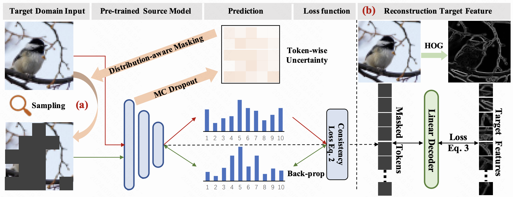

# Continual-MAE: Adaptive Distribution Masked Autoencoders for Continual Test-Time Adaptation
[**Continual-MAE: Adaptive Distribution Masked Autoencoders for Continual Test-Time Adaptation**](https://openaccess.thecvf.com/content/CVPR2024/papers/Liu_Continual-MAE_Adaptive_Distribution_Masked_Autoencoders_for_Continual_Test-Time_Adaptation_CVPR_2024_paper.pdf)

Jiaming Liu*, Ran Xu*, Senqiao Yang, Renrui Zhang, Qizhe Zhang, Zehui Chen, Yandong Guo, Shanghang Zhang



## Overview

Continual Test-Time Adaptation (CTTA) is proposed to migrate a source pre-trained model to continually changing target distributions, addressing real-world dynamism. Existing CTTA methods mainly rely on entropy minimization or teacher-student pseudo-labeling schemes for knowledge extraction in unlabeled target domains. However, dynamic data distributions cause miscalibrated predictions and noisy pseudo-labels in existing self-supervised learning methods, hindering the effective mitigation of error accumulation and catastrophic forgetting problems during the continual adaptation process. To tackle these issues, we propose a continual self-supervised method, Adaptive Distribution Masked Autoencoders (ADMA), which enhances the extraction of target domain knowledge while mitigating the accumulation of distribution shifts. Specifically, we propose a Distribution-aware Masking (DaM) mechanism to adaptively sample masked positions, followed by establishing consistency constraints between the masked target samples and the original target samples. Additionally, for masked tokens, we utilize an efficient decoder to reconstruct a hand-crafted feature descriptor (e.g., Histograms of Oriented Gradients), leveraging its invariant properties to boost task-relevant representations. Through conducting extensive experiments on four widely recognized benchmarks, our proposed method attains state-of-the-art performance in both classification and segmentation CTTA tasks.

## Installation

Please create and activate the following conda envrionment. 
```bash
# It may take several minutes for conda to solve the environment
conda update conda
conda env create -f environment.yml
conda activate continual-mae 
```

## Classification Experiments

### Cifar10-to-Cifar10C task 
Please load the source model from [here](https://drive.google.com/file/d/1ID6UBs0wagptQe6B69czWAQtMPTKc_Gw/view?usp=sharing)

```bash
cd cifar
bash ./bash/cifar10/source_vit.sh # Source model directly test on target domain
bash ./bash/cifar10/tent_vit.sh # Tent 
bash ./bash/cifar10/cotta_vit.sh # CoTTA
bash ./bash/cifar10/vida_vit.sh # ViDA
```

## Citation
Please cite our work if you find it useful.
```bibtex
@article{liu2024continual,
  title={Continual-MAE: Adaptive Distribution Masked Autoencoders for Continual Test-Time Adaptation},
  author={Liu, Jiaming and Xu, Ran and Yang, Senqiao and Zhang, Renrui and Zhang, Qizhe and Chen, Zehui and Guo, Yandong and Zhang, Shanghang},
  booktitle={Proceedings of the IEEE/CVF Conference on Computer Vision and Pattern Recognition},
  pages={28653--28663},
  year={2024}
}
```

## Acknowledgement 
+ CoTTA code is heavily used. [official](https://github.com/qinenergy/cotta) 
+ KATANA code is used for augmentation. [official](https://github.com/giladcohen/KATANA) 
+ Robustbench [official](https://github.com/RobustBench/robustbench) 


